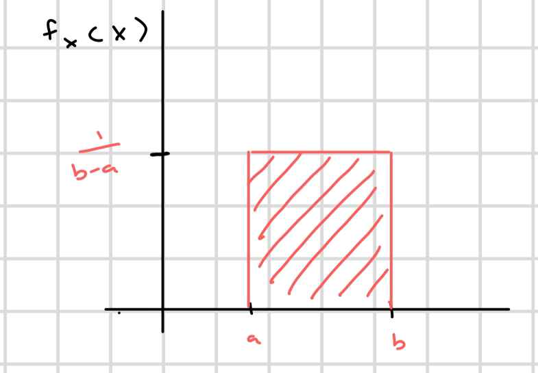
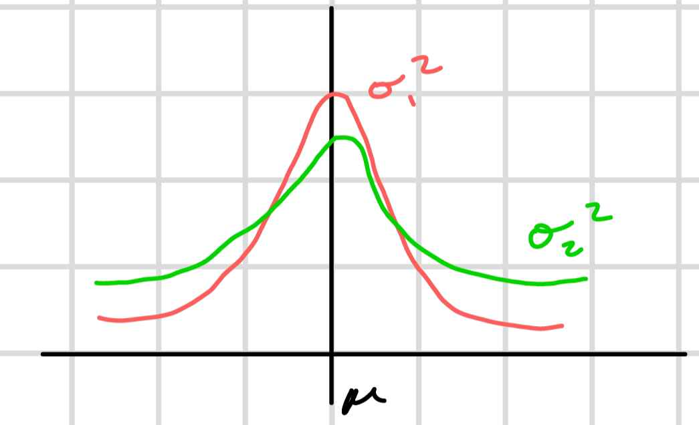
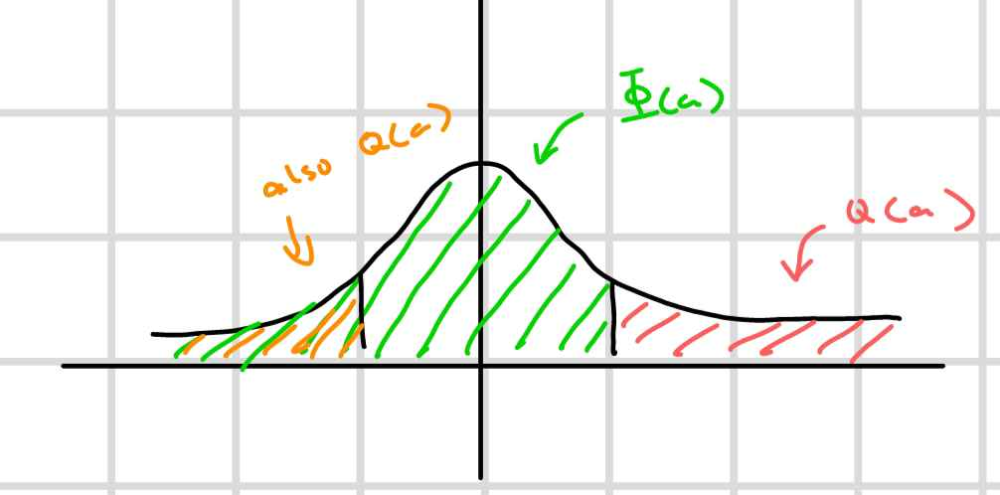

All probabilities of interest associated witha  given random variable `X` can be expressed in terms of a CDF

1. $P(a\lt X \le b) = F_X(b) - F_X(a)$
2. $P(X = b) = F_X(b) - F_X(b^-)$
3. $P(x \gt a) = 1- F_X(a)$
4. $P(a\le X \le b) = F_X(b) - F_X(a^-)$
5. $P(a \lt X \lt b) = -F_X(a) + F_X(b^-)$

## Continuous RV

There are no jumps in the CDF. So $\forall a \in \Bbb{R} P(X=a) = 0$. Therefore PMF provides no information.

## Probabilty Density Function(PDF)

$$f_X = \frac{d}{dx}F_X(x)$$

$$
\begin{align*}
P(x \lt X \in x+h) &= \frac{F(x+h)-F_X(x)h}{h}\\
&= f_X(x)h 
\end{align*}
$$

From this equation we know that the probability is equal to the density times the height.

### Properties of PDF

1. $f_X(x) \ge 0$
2. $\int_{-\infty}^{x}f_X(t)dt = F_X(x)$
3. $P(a \le x \le b)$ for continuous RV = $\int_{a}^{b}f_X(t)dt$
4. $\int_{-\infty}^{\infty}f_X(t)dt = 1$

Examples: uniform continuous RV: x ~ uniform[a,b]

$$
\begin{align*}
\int_{-\infty}^{\infty}f_X(t)dt &= 1\\
\int_{a}^{b}cdt &= 1\\
c(b-a) &=1\\
c &= \frac{1}{b-a}
\end{align*}
$$

Describing uniform continuous RV ~ uniform[a,b]

$$
f_X(x) = 
\begin{cases}
   \frac{1}{b-a} & a \le x \le b\\
   0 & \text{otherwise}
\end{cases}
$$

$$
F_X(x) = 
\begin{cases}
   0 & x \lt a \\
   \frac{x-a}{b-a} & a \le x \le b\\
   1 & x \gt b
\end{cases}
$$

The expectation of a continuous RV is:

$$
\Bbb{E}[g(x)] = \int_{-\infty}^{\infty}g(x)f_X(x)dx
$$

Example: Compute the expectation for x~uniform[a,b]

$$
\begin{align*}
\Bbb{E}[x] &= \int_{a}^{b}x\frac{1}{b-a}dx\\
&=\frac{b^2-a^2}{2(b-a)}\\
&=\frac{a+b}{2}
\end{align*}
$$

$$
\begin{align*}
\text{VAR}(X) = \Bbb{E}[(X-m_X)^2] = \Bbb{E}[X^2] - m_X^2\\
\Bbb{E}[X^2] &= \int_{a}^{b}x^2\frac{1}{b-a}dx\\
&= \frac{b^3-a^3}{3(b-a)}\\
\text{VAR}(X) = \frac{b^3-a^3}{3(b-a)} - (\frac{a+b}{2})^2
\end{align*}
$$

Example:

$$
f_X(x) = 
\begin{cases}
   cx & 0 \le x \le 2\\
   0 & \text{otherwise}
\end{cases}
$$

* Find constant $c$
* Find the CDF of $X$
* Compute $P(X\lt 1)$

$$
\begin{align*}
\int_0^2cxdx &= 1\\
[\frac{cx^2}{2}]_0^2 &= 1\\
2c &= 1\\
c &= \frac{1}{2}
\end{align*}
$$

CDF of $X = F_X(x)$

$$
F_X(x) \text{ for } 0 \le x \le 2
$$

$$
\begin{align*}
&= \int_{-\infty}^xf_X(t)dt \\
&= \int_0^x\frac{1}{2}tdt \\
&= [\frac{t^2}{4}]_0^x\\
&= \frac{x^2}{4}
\end{align*}
$$

$$
F_X(x) =
\begin{cases}
    0 & x \lt 0\\
    \frac{x^2}{4} & 0\le x \le 2\\
    1 & x\gt 2
\end{cases}
$$

$$
F_X(1) = \frac{1}{4}
$$

## Exponential RV($\lambda$)

$\lambda \gt 0$

$$
P(X \gt a) = e^{-\lambda a} \text{ where } x\gt 0, a\gt 0
$$

$$
F_X(a) = 1-e^{-\lambda a}
$$

$$
f_X(a) = \lambda e^{-\lambda a} \gt 0
$$

### Memoryless Property:

We say that RV X is mermoryless if:

$$
P(X \gt t+h | x \gt t) = P(X \gt h)
$$

$$
\frac{P(X \gt t+h , x \gt t)}{P(X \gt t)} = \frac{P(X \gt t+h)}{P(X \gt t)}
$$

because $t+h$ happens after $t$.

Specifically for x~exp($\lambda$):

$$
P(x\gt t+h | x \gt t)\frac{P(X \gt t+h)}{P(X \gt t)} = \frac{e^{-\lambda (t+h)}}{e^{-\lambda t}} = e^{-\lambda h} = P(x \gt h)
$$

$$
\Bbb{E}[x] = \int_0^\infty x\lambda e^{-\lambda x}dx = \frac{1}{\lambda}
$$

$$
\text{VAR}(x) = \Bbb{E}[x^2] - \frac{1}{\lambda ^2} = \frac{1}{\lambda ^2}
$$

## Gaussian RV x~N($\mu, \sigma ^2$)

$$
f_X(x) = \frac{1}{\sqrt{2\pi}\sigma}e^{-\frac{(x-\mu)^2}{2\sigma^2}} \text{ for } x \in \Bbb{R}, f_X(X)\gt 0
$$

$$
\sigma_2^2 > \sigma_1^2
$$

Note that any Gaussian $N(\mu, \sigma^2)$ can be expressed in terms of $N(0, 1)$. This is called the `Standard Normal`.

$$
f_X(x) = \frac{1}{\sqrt{2\pi}}e^{-\frac{x^2}{2}}
$$

Suppose $Y ~ N(\mu, \sigma^2)$:

$$
\begin{align*}
P(Y \lt a) &= \int_{-\infty}^{a}\frac{1}{\sqrt{2\pi}\sigma}e^{-\frac{(Y-\mu)^2}{2\sigma^2}}\\
t=\frac{Y-\mu}{\sigma}\\
\frac{dy}{dt} = \sigma\\
dy = \sigma dt\\
&=\int_{-\infty}^{\frac{a-\mu}{\sigma}}\frac{1}{\sqrt{2\pi}}e^{-\frac{t^2}{2}} = P(X \le \frac{a-\mu}{\sigma})\\
\end{align*}
$$

$F_Y(a) = F_X(\frac{a-\mu}{\sigma})$ where $Y ~ N(\mu, \sigma^2)$ and $X ~ N(0,1)$

Proof that $\int_{-\infty}^{\infty}f_X(x)dx = 1$

$$
\begin{align*}
&\int_{-\infty}^{\infty}\frac{1}{\sqrt{2\pi}}e^{-\frac{x^2}{2}}dx = 1\\
&a * a = 1\\
&a = 1 \text{ a = -1 is not a probelm because P cannot be negative}\\
&=\int_{-\infty}^{\infty}\frac{1}{\sqrt{2\pi}}e^{-\frac{x^2}{2}}dx\int_{-\infty}^{\infty}\frac{1}{\sqrt{2\pi}}e^{-\frac{y^2}{2}}dy\\
&=\int_{-\infty}^{\infty}\int_{-\infty}^{\infty}\frac{1}{\sqrt{2\pi}}e^{-\frac{x^2+y^2}{2}}dxdy\\
x=r\cos\theta, y=r\sin\theta\\
&=\int_{0}^{2\pi}\int_{0}^{\infty}\frac{1}{\sqrt{2\pi}}e^{-\frac{r^2}{2}}rdrd\theta\\
\end{align*}
$$

$$
\begin{align*}
\text{Jacobian:}\\
\frac{dx}{dr}=\cos \theta, \frac{dx}{d\theta} =r\sin \theta\\
\frac{dy}{dr}=\sin \theta, \frac{dy}{d\theta} =r\cos \theta\\
\text{det}
\begin{bmatrix}
\frac{dx}{dr} & \frac{dx}{d\theta}\\
\frac{dy}{dr} & \frac{dy}{d\theta}\\
\end{bmatrix}
= r\cos^2 \theta + r\sin^2 \theta = r
\end{align*}
$$

$$
\begin{align*}
&=\int_{0}^{\infty}re^{-\frac{r^2}{2}}dr\int_{0}^{2\pi}\frac{1}{\sqrt{2\pi}}d\theta\\
& = \text{left side is PDF of exponential, right side is PDF of uniform} = 1
\end{align*}
$$

Standard Gaussian:

$\Phi(x)$ denotes the CDF of a standard Gaussian.

$$
\Phi(x) = \int_{-\infty}^{x}\frac{1}{\sqrt{2\pi}}e^{-\frac{t^2}{2}}
$$

For any Gausian:

$$
F_Y(a) = \Phi(\frac{a-\mu}{\sigma})
$$

The Q function: tail probability of standard Gaussian

$$
Q(a) = P(X > a), X ~ N (0,1)
$$

$$
\Phi (a) = 1 - Q(a)
$$

$$
Q(-a) = 1- Q(a) \text{ by symmetry}
$$

For Standard Gaussian:

$$
\Bbb{E}[x] = \int_{-\infty}^{\infty}\frac{1}{\sqrt{2\pi}}xe^{-\frac{x^2}{2}}dx = 0
$$

$$
\text{VAR}(x) = \Bbb{E}[x^2] - (\Bbb{E}[x])^2 = \Bbb{E}[x^2] = 1
$$

For any Gaussian: $Y ~ N(\mu, \sigma^2), x= \frac{y-\mu}{\sigma}$

$$
\Bbb{E}[y] = \Bbb{E}[\sigma x + \mu] = \mu
$$

$$
\text{VAR}(y) = \sigma^2
$$

`mu` is the mean of Y

`sigma^2` is the variance of Y

`sigma = sqrt(sigma^2)` is called the standard deviation

### Example

Consider $X ~ N (-1, 4)$. Express $P(x<0)$ in terms of Q function.

$$
\begin{align*}
P(x < 0) &= P(\frac{x-\mu}{\sigma} < \frac{0-\mu}{\sigma}), \sigma > 0\\
P(x < 0) &= P(\frac{x+1}{2} < \frac{1}{2})\\
&= P(Y < \frac{1}{2}) = 1- Q(\frac{1}{2})
\end{align*}
$$

Consider $X ~ N (5, 100)$. Express $P(x>25)$ in terms of Q function.

$$
\begin{align*}
P(x > 25) &= P(\frac{x-\mu}{\sigma} > \frac{25-\mu}{\sigma}), \sigma > 0\\
&= P(\frac{x-5}{10} < \frac{25 - 5}{10})\\
&= P(Y > 2)\\
&= Q(2)
\end{align*}
$$

## Chi Square RV

Suppose $X_1, X_2, ..., X_k$ are independent $N(0, 1)$

Let $Y = \sum_{i=1}^{k}x_i^2$

$$
f_Y(y)= \frac{y^{\frac{k-2}{2}e^\frac{-y}{2}}}{2^{\frac{k}{2}}\Gamma(\frac{k}{2})}
$$

$$
\text{gamma function }\Gamma(z) = \int_0^\infty x^{z-1}e^{-x}dx
$$

### Special Case k=2:

$$
\Gamma(1) = \int_0^\infty x^{0}e^{-x}dx = 1
$$

$$
f_Y(y)= \frac{y^{\frac{2-2}{2}e^\frac{-y}{2}}}{2^{\frac{2}{2}}\Gamma(\frac{2}{2})} = \frac{e^{-\frac{y}{2}}}{2}
$$

This case is $Y ~ \text{exponential}(\frac{1}{2})$

## Cauchy RV

$Z = \frac{x}{y}$ for $X,Y ~ N(0,1)$ is a Standard Gaussian and is independent.

$$
f_Z(z)=\frac{1}{\pi (1+z^2)} \text{ for }-\infty < z < \infty
$$

$$
\Bbb{E}[z] = \int_{-\infty}^{\infty}z\frac{1}{\pi (1+z^2)}dz \text{ does not exist}
$$

This RV does not have a mean.
