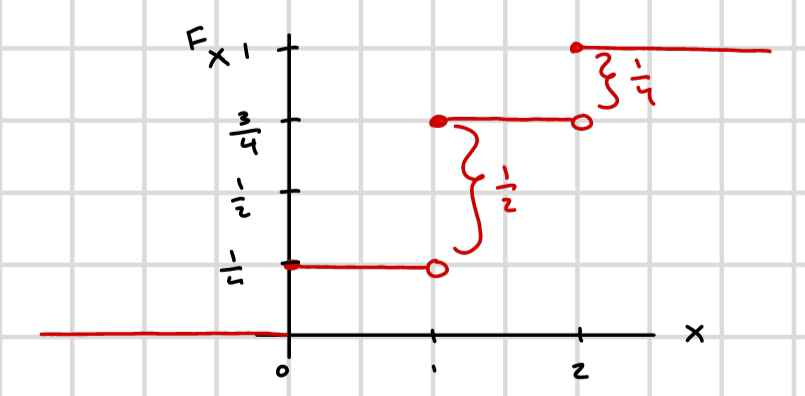

# Examples of Important Discrete RVs

## Uniform discrete RV

Let $S_x = \{1,2,...,L\}$

PMF: $P(X=X_i) = \frac{1}{L}$ for $1 \le i \le L$

$$
\text{Note that:} \sum_{i=1}^{n} i= \frac{n(n+1)}{2}
$$

$$
\Bbb{E}[X] = \sum_{i=1}^LiP(x=i)
$$

$$
= \sum_{i=1}^Li\frac{1}{L}
$$

$$
= \frac{1}{L}\sum_{i=1}^Li
$$

$$
= \frac{1}{L}\frac{L(L+1)}{2} = \frac{L+1}{2}
$$

### Example:

| $i$ | $P(X=i)$ |
| --- | --- |
| $1$ | $\frac{1}{5}$ |
| $2$ | $\frac{1}{5}$ |
| $3$ | $\frac{1}{5}$ |
| $4$ | $\frac{1}{5}$ |
| $5$ | $\frac{1}{5}$ |

$$
\text{VAR}(X) = \Bbb{E}[X^2]-m_X^2
$$

$$
\text{Note that:} \sum_{i=1}^{n} i^2= \frac{n(n+1)(2n+1)}{6}
$$

$$
\Bbb{E}[X^2] = \sum_{i=1}^Li^2P(x=i)
$$

$$
= \sum_{i=1}^Li^2\frac{1}{L}
$$

$$
= \frac{1}{L}\sum_{i=1}^Li^2
$$

$$
= \frac{1}{L}\frac{L(L+1)(2L+1)}{6} = \frac{(L+1)(2L+1)}{6}
$$

$$
\text{VAR}(X) = \frac{(L+1)(2L+1)}{6} - (\frac{L+1}{2})^2
$$

## Bernouli RV(p)

$$
X = \begin{cases}
   1 &\text{with probability } p \text{ for } 0 < p < 1\\
   0 &\text{with probability } 1-p
\end{cases}
$$

Bernouli($\frac{1}{2}$):

| $X$ | $P(X)$ |
| --- | --- |
| $0$ | $\frac{1}{2}$ |
| $1$ | $\frac{1}{2}$ |

$$
\Bbb{E}[X] = 1\times p + 0(1-p) = p
$$

$$
\text{VAR}(X) = \Bbb{E}[X^2] - p^2
$$

$$
\Bbb{E}[X^2] = 1^2p + 0^2(1-p) = p
$$

$$
\text{VAR}(X) = p - p^2 = p(1-p)
$$

Suppose we toss a biased coin. Bernouli($\frac{1}{4}$)

* $P(H) = \frac{1}{4}$ where $H \rightarrow 1$
* $P(T) = \frac{3}{4}$ where $T \rightarrow 0$

$$
\text{VAR}(X) = \frac{1}{4}(1- \frac{1}{4}) = \frac{3}{16}
$$

Now suppose we have another coin. Bernouli($\frac{3}{4}$):

* $P(H) = \frac{3}{4}$ where $H \rightarrow 1$
* $P(T) = \frac{1}{4}$ where $T \rightarrow 0$

Note that the variances will be the same.

## Independence of RVs

Two random variables $X$ and $Y$ are independent if:

$$
P(\{X \in A\} \cap \{Y \in B\}) = P(\{X \in A\}) \times P(\{Y \in B\})
$$

for all choices $A$ and $B$, $A \subseteq S_x$, $B \subseteq S_y$

## Geometric RV(p)

The number of coin tosses of a biased coin until $H$ appears for the first time, where $P(H)=P$.

$$
Z = \begin{cases}
   1 &\text{if H with probability } p \text{ for } 0 < p < 1\\
   0 &\text{if T with probability } 1-p
\end{cases}
$$

| Coin | $X$ | $P(X)$ |
| --- | --- | --- |
| $H$ | $1$ | $p$ |
| $TH$ | $2$ | $(1-p)p$ |
| $TTH$ | $3$ | $(1-p)^2p$ |
|  | $\vdots$  |  |
| $T...TH$ | $k$ | $(1-p)^kp$ |

$$
P(X =k)=(1-p)^{k-1}p \text{ for } k \ge 1
$$

$$
\text{Note: } \sum_{i=0}^\infty x^i = \frac{1}{1-x} \text{ for } |x| < 1
$$

$$
\sum_{i=0}^\infty ix^{i-1} = \frac{1}{(1-x^2)}
$$

$$
\begin{align*}
\sum_{i=1}^\infty (1-p)^{i-1}p &= p \sum_{i=1}^\infty (1-p)^{i-1} \\
&= P\sum_{i=0}^\infty (1-p)^{i} \\
&= \frac{1}{1-(1-p)}p = 1
\end{align*}
$$

$$
\Bbb{E}[X] = \sum_{i=1}^{\infty}i(1-p)^{i-1}p = \frac{1}{p}
$$

## Pairs of Random Variables

Recall for 1 RV, we assign a real-values number to each outcome.

Now we assign a pair of real valued numbers.

Example: Fair Coin

* Let $X$ denote the number of tails in first toss
* Let $Y$ denote the number of tails in both tosses

| Outcomes | $(X,Y) \in Sxy$ | Probability |
| --- | --- | --- |
| $HH$ | $(0, 0)$| $\frac{1}{4}$ |
| $HT$ | $(0, 1)$| $\frac{1}{4}$ |
| $TH$ | $(1, 1)$| $\frac{1}{4}$ |
| $TT$ | $(1, 2)$| $\frac{1}{4}$ |

$Sx = \{0,1\}$

$Sy=\{0,1,2\}$

You can create a table using $Sx$ and $Sy$ values.

|  | $Y_1$ |  $Y_1$ | ...  |  $Y_n$| 
| --- | --- | --- | ---| --- |
| $X_1$ | $P(X_1, Y_1)$| $P(X_1, Y_2)$ | ... | $P(X_1, Y_n)$ |
| $X_1$ | $P(X_2, Y_1)$| $P(X_2, Y_2)$ | ... | $P(X_2, Y_n)$ |
| $\vdots$ | $\vdots$ | $\vdots$ | | $\vdots$ | 
| $X_n$ | $P(X_n, Y_1)$ | $P(X_n, Y_2)$ | ... | $P(X_n, Y_n)$

The sum of all probabilities in the table is equal to $1$

Example:

|  | $0$ |  $1$  | $2$   |
| --- | --- | --- | ---|
| $0$  | $\frac{1}{4}$| $\frac{1}{4}$ | $0$ |
| $1$  | $0$ | $\frac{1}{4}$ | $\frac{1}{4}$ |

$$
\begin{align*}
P(Y=1)&= P((0,1)) + P((1,1))\\
&= \frac{1}{4} + \frac{1}{4}\\
&= \frac{1}{2}
\end{align*}
$$

$$
\begin{align*}
P(X=1)&= P((1,0)) + P((1,1)) + P((1,2))\\
&= 0 + \frac{1}{4} + \frac{1}{4}\\
&= \frac{1}{2}
\end{align*}
$$

## (Un)correlatedness of RVs

Consider $X$, $Y$ as two discrete RVs

$$\begin{align*}
\Bbb{E}[X+Y] &= \sum_Y \sum_X (X+Y) P(X=x, Y=y) \\
&=\sum_Y \sum_X X P(X=x, Y=y) + \sum_Y \sum_X Y P(X=x, Y=y) \\
&=\sum_X X \sum_Y P(X=x, Y=y) + \sum_Y Y\sum_X P(X=x, Y=y) \\
&=\sum_X X P(X=x) + \sum_Y Y P(Y=y) \\
&=\Bbb{E}[X] + \Bbb{E}[Y]
\end{align*}
$$

Linearity of Expectations. The general result of discrete RVs.

Now suppose $X \perp\!\! \perp Y$:

$X$ and $Y$ are independent:

$$ \forall X, Y$$

$$ P(X=x, Y=y) = P(X=x)P(Y=y)$$

Consider
$$\begin{align*}
\Bbb{E}[XY] &= \sum_Y \sum_X xyP(X=x, Y=y) \\
\text{if independent:} \\
&= \sum_Y \sum_X xyP(X=x)P(Y=y)\\
&= \sum_Y yP(Y=y)\sum_X xP(X=x)\\
&= \Bbb{E}[X] \times \Bbb{E}[Y]
\end{align*}
$$

If $X \perp\!\! \perp Y$ then we say that $X$ and $Y$ are `uncorrelated`. Note that independence implies uncorrelatedness but not the other way around.

Example:

```
X        -1     0     1
P(X)     1/3   1/3   1/3

Y=|X|     0     1
P(Y)     1/3   1/3
```

```
Possible pairings: Each with probability 1/3
(X, Y) ==> (-1, 1), (0,0), (1,1)
```

$$\begin{align*}
\Bbb{E}[XY] &= \sum_Y \sum_X xyP(X=x, Y=y) \\
&= -1(\frac{1}{3}) + 0(\frac{1}{3}) + 1(\frac{1}{3}) \\
&= 0
\end{align*}
$$

$$\begin{align*}
\Bbb{E}[X]\Bbb{E}[Y] &= 0(\frac{2}{3}) \\
&= 0
\end{align*}
$$

Is it true that $\text{VAR}(X+Y) = \text{VAR}(X) + \text{VAR}(Y)$

And if not always true, under what condition does it hold?

$$\begin{align*}
\text{VAR}(X+Y) &= \Bbb{E}[(X+Y)^2] - (\Bbb{E}[X+Y])^2\\
&= \Bbb{E}[X^2 + 2XY + Y^2] - (\Bbb{E}[X] + \Bbb{E}[Y])^2\\
&= \Bbb{E}[X^2 + 2XY + Y^2] - (m_X + m_Y)^2\\
&= \Bbb{E}[X^2] + \Bbb{E}[2XY] + \Bbb{E}[Y^2] - (m_X^2 +2m_Xm_Y + m_Y^2)\\
&= \text{VAR}(X) + \text{VAR}(Y) + 2\Bbb{E}[XY] - 2m_Xm_Y\\
&=> \text{VAR}(X+Y) = \text{VAR}(X) + \text{VAR}(Y)
\end{align*}
$$

if $X$ and $Y$ are uncorrelated.

## Binomial RV(n, p)

$X$ is a Binomial RV: it denotes the number of successes in n independent Bernoulli trials, weach with probability of success p.

$$
Y = \begin{cases}
1 \text{ with probability } p \text{ "success"} \\
0 \text{ with probability } 1-p \text{ "failure"} \\
\end{cases}
$$

$$
P(X=k) = {n\choose k}p^k (1-p)^{n-k} \text{ for } 0 \le k \le n
$$

Example: Toss a biased coin 10 times

$P(H) = p$

Count how many times we observed H.

$X \in {0, 1, ..., 10}$

$P(X=0) = (1-p)^10$

$P(X=1) = {10 \choose 1}p^1(1-p)^9$

$$\begin{align*}
\Bbb{E}[X] &= \sum_{k=0}^nkP(X=k)\\
&= \sum_{k=0}^nk{n\choose k}p^k(1-p)^{n-k}\\
X &= Y_1 + Y_2 +...+ Y_n\text{ where }Y_i=
\begin{cases}
1 \text{ with probability } p\\
0 \text{ with probability } 1-p \\
\end{cases}
\end{align*}
$$

$X$ binomial(n,p) is the sum of n independent Bernoulli RVs(p). Therfore:

$$\begin{align*}
\Bbb{E}[X] &= \Bbb{E}[Y_1] + \Bbb{E}[Y_2] + ... + \Bbb{E}[Y_n]\\
&= n\times p
\end{align*}
$$

$$\begin{align*}
\text{VAR}(X) &= n\text{VAR}(Y_i)\\
&=n\times p(1-p)
\end{align*}
$$

## Poisson RV ($\lambda$)

Poisson RV is a discrete RV that measures the number of events per unit time, where events occur with some known average rate, $\lambda$, independently of other events. In this definition, events are occurances, not outcomes.

$\lambda$ is the average arrival rate

$$
P(X=k) = \frac{\lambda^ke^{-k}}{k!}
$$

## Continuous RVs

$$
F_X(x) = P(X \le x)
$$

$$\begin{align*}
P(X \le x) &= P(X \in (-\infty, x))\\
&= P(\theta : X(\theta) \le x)\\
\theta \in S \text{ sample space}
\end{align*}
$$

Example: SUppose we toss a fair coin twice. Let's denote the number of heads

```
    TT  TH  HT  HH
X    0   1   1   2
```

```
X       0       1       2
P(X)   1/4     1/2     1/4
```

$$
F_X(a) = P(X \le a)
$$

$$\begin{align*}
P(X \le 0) &= \frac{1}{4}\\
P(X \le 0.99) &= \frac{1}{4}\\
P(X \le 1) &= \frac{1}{4} + \frac{1}{2} = \frac{3}{4}\\
P(X \le 2) &= \frac{1}{4} + \frac{1}{2} + \frac{1}{4} = 1
\end{align*}
$$



### Properties of CDF

1. $$0 \le F_X(x) \le 1$$
2. 
$$
\begin{align*}
&\lim_{x\rightarrow \infty}F_X(x)=1 \\ 
&\lim_{x\rightarrow -\infty}F_X(x)=0
\end{align*}
$$
3. $F_X$ is non-decreasing
4. CDF is right continuous

$$
F_X(b) = \lim_{h\rightarrow 0}F_X(b+h) \text{ for } h>0
$$
$$
F_X(b) = F_X(b^+)
$$

CDF is not necessarily left-continuous
