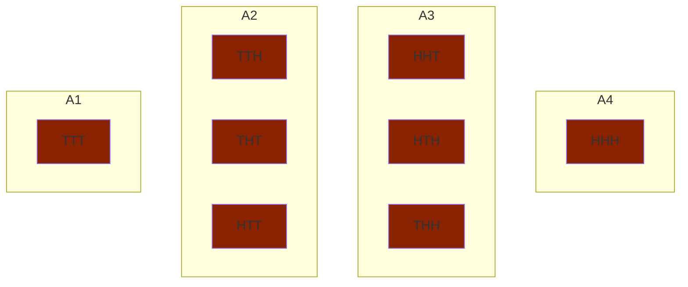

# Random Variables(RV), Probability Mass Function(PMF) of discrete RVs, Expectation-mean-variance

## Random Variables

A `random variable` is a function that assigns a real valued number to each outcome of a random experiment. 

Recall: $S$ denotes the sample space associated with a given random experiment. Let $X$ denote a value to each element in $S$. $Sx$ denotes the values of $X$ that it takes on.

### Example:

Suppose we toss a coin 3 times. Let $X$ a RV denote the number of heads.

$$
S = \{TTT, TTH, THT, HTT, THH, HTH, HHT, HHH\}
$$

$$
Sx = \{0, 1, 2, 3\}
$$

Any event associated with a random experiment taht is described in terms of $Sx$ has an equivalent interpretation in terms of $S$.

Example: $x=2, \{HHT, HTH, THH\}$

We can partition $S$ in terms of the values in $Sx$.



$A_1$ is a set of outcomes for which $X=0$.

$A_2$ is a set of outcomes for which $X=1$.

$A_3$ is a set of outcomes for which $X=2$.

$A_4$ is a set of outcomes for which $X=3$.

## Probability Mass Function(PMF) of a discrete RV

A `discrete` RV takes on countably many different values.

A discrete RV is fully described by its PMF.

$P(X=X_i) = P(A_I)$ where $A_i$ is the set of outcomes for which $X_S = X_i$.

### Example:

Suppose we did the previous example with a fair coin. 

$$
P(H) = P(T) = \frac{1}{2}
$$

$$
P(HHH)=\frac{1}{8}, P(X=3)=\frac{1}{8}
$$

$$
P(TTT)=\frac{1}{8}, P(X=0)=\frac{1}{8}
$$

$$
P(X=1)=\frac{3}{8}
$$

$$
P(X=2)=\frac{3}{8}
$$

### Properties of PMF:

1. $$P_x(X=X_i) \ge 0$$
2. $$\sum_{i=1 \in S_x}P(X=X_i) = 1$$
3. $$P(X in B) = \sum_{X_i = B}P_x(X=X_i)$$
   $$= P(\cup_{X_i=B} \{S:X(S)=X_i\})$$
   $$\sum_{X_i\in B}P(\{S:X(S)=X_i\})$$

### Example: Coin Toss

What is the probability that $X$ is at least $2$?

Recall $Sx = \{0,1,2,3\}$.

$$
P(X \ge 2) = P(X \in \{2,3\})
$$

$$
= P(X=2) + P(X=3)
$$

$$
= \frac{3}{8} + \frac{1}{8}
$$

$$
= \frac{1}{2}
$$

Think of PMF as a table:
| $X$ | $P(X=X_i)$ |
| --- | --- |
| $X_1$ | $P_1$ |
| $X_2$ | $P_2$ |
| $\vdots$ | $\vdots$ |
| $X_n$ | $P_n$ |

## Expectation

For any function $g(x)$ of a RV $x$, the expected value of $g(x)$, $\Bbb{E}[g(x)]$ is:

$$\Bbb{E}[g(x)] = \sum_{X_i=S_x}g(X_i)P(X=X_i)$$

* weighted average:
* the weight is specified by the partition of that $X_i$
* $X_i$'s could be equally likely

### Example:
| $X$ | $P(X)$ |
| --- | --- |
| $3$ | $\frac{1}{8}$ |
| $2$ | $\frac{3}{8}$ |
| $1$ | $\frac{3}{8}$ |
| $0$ | $\frac{1}{8}$ |

$$\Bbb{E}[X] = 0\times\frac{1}{8} + 1\times \frac{3}{8} + 2\times \frac{3}{8} + 3\times \frac{1}{8}$$

### Another Example:

| $X$ | $P(X)$ |
| --- | --- |
| $-1$ | $\frac{5}{12}$ |
| $0$ | $\frac{1}{3}$ |
| $2$ | $\frac{1}{4}$ |

$$\Bbb{E}[X] = -1\times\frac{5}{12} + 0\times \frac{1}{3} + 2\times \frac{1}{4}$$

$$\Bbb{E}[X^3] = -1^3\times\frac{5}{12} + 0^3\times \frac{1}{3} + 2^3\times \frac{1}{4}$$

### Important Properties of $\Bbb{E}[g(x)]$

Let $Z = ag(x)+bh(x) + c$ where $a,b,c$ are constants and $g(x)$ and $h(x)$ are functions of RV $x$.

Observe that $Z$ is also a RV.

Let's compute $\Bbb{E}[Z]$.

$$
\Bbb{E}[Z] = \Bbb{E}[ag(x) + bh(x) + c]
$$

$$
= \sum_{X_i\in S_X}(ag(X_i)+bh(X_i)+c)P(X=X_i)
$$

$$
= \sum_{X_i\in S_X} ag(X_i) P(X=X_i) + \sum_{X_i\in S_X}bh(X_i)P(X=X_i)+ \sum_{X_i\in S_X}c P(X=X_i)
$$

$$
\text{Note: }c\sum_{X_i\in S_X}P(X=X_i)=c\times 1 = c
$$

$$
= a\sum_{X_i\in S_X} g(X_i) P(X=X_i) + b\sum_{X_i\in S_X}h(X_i)P(X=X_i) + c
$$

$$
= a\Bbb{E}[g(x)]+b\Bbb{E}[h(x)]+c
$$

### Consequences:

1. $$\Bbb{E}[aX] = a\Bbb{E}[X]$$
2. $$\Bbb{E}[X + c] = \Bbb{E}[X] + c$$
3. $$\Bbb{E}[c] = c$$

## Mean and Variance of RV $X$

`m` mean is: $\Bbb{E}[X] = \sum_{X_i\in S_X}X_iP(X=X_i) = m_X$

`V` variance is: $\Bbb{E}[(X-m_X)^2] = \sum_{X_i\in S_X}(X_i-m_X)^2P(X=X_i)$

$$ 
\Bbb{E}[(X-m_X)^2] = \Bbb{E}[X^2] - \Bbb{E}[2m_XX] + \Bbb{E}[m_X^2]
$$

$$
= \Bbb{E}[X^2] - 2m_X\Bbb{E}[X] + m_X^2
$$

$$
= \Bbb{E}[X^2] - 2m_X^2 + m_X^2
$$

$$
= \Bbb{E}[X^2] - m_X^2
$$

$$
\text{VAR}(aX) = a^2\text{VAR}(X)
$$

$$
\text{VAR}(X + b) = \text{VAR}(X)
$$

## (Un)correlatedness of RVs

Consider $X$, $Y$ as two discrete RVs

$$\begin{align*}
\Bbb{E}[X+Y] &= \sum_Y \sum_X (X+Y) P(X=x, Y=y) \\
&=\sum_Y \sum_X X P(X=x, Y=y) + \sum_Y \sum_X Y P(X=x, Y=y) \\
&=\sum_X X \sum_Y P(X=x, Y=y) + \sum_Y Y\sum_X P(X=x, Y=y) \\
&=\sum_X X P(X=x) + \sum_Y Y P(Y=y) \\
&=\Bbb{E}[X] + \Bbb{E}[Y]
\end{align*}
$$

Linearity of Expectations. The general result of discrete RVs.

Now suppose $X \perp\!\! \perp Y$:

$X$ and $Y$ are independent:

$$ \forall X, Y$$

$$ P(X=x, Y=y) = P(X=x)P(Y=y)$$

Consider
$$\begin{align*}
\Bbb{E}[XY] &= \sum_Y \sum_X xyP(X=x, Y=y) \\
\text{if independent:} \\
&= \sum_Y \sum_X xyP(X=x)P(Y=y)\\
&= \sum_Y yP(Y=y)\sum_X xP(X=x)\\
&= \Bbb{E}[X] \times \Bbb{E}[Y]
\end{align*}
$$

If $X \perp\!\! \perp Y$ then we say that $X$ and $Y$ are `uncorrelated`. Note that independence implies uncorrelatedness but not the other way around.

Example:

```
X        -1     0     1
P(X)     1/3   1/3   1/3

Y=|X|     0     1
P(Y)     1/3   1/3
```

```
Possible pairings: Each with probability 1/3
(X, Y) ==> (-1, 1), (0,0), (1,1)
```

$$\begin{align*}
\Bbb{E}[XY] &= \sum_Y \sum_X xyP(X=x, Y=y) \\
&= -1(\frac{1}{3}) + 0(\frac{1}{3}) + 1(\frac{1}{3}) \\
&= 0
\end{align*}
$$

$$\begin{align*}
\Bbb{E}[X]\Bbb{E}[Y] &= 0(\frac{2}{3}) \\
&= 0
\end{align*}
$$

Is it true that $\text{VAR}(X+Y) = \text{VAR}(X) + \text{VAR}(Y)$

And if not always true, under what condition does it hold?

$$\begin{align*}
\text{VAR}(X+Y) &= \Bbb{E}[(X+Y)^2] - (\Bbb{E}[X+Y])^2\\
&= \Bbb{E}[X^2 + 2XY + Y^2] - (\Bbb{E}[X] + \Bbb{E}[Y])^2\\
&= \Bbb{E}[X^2 + 2XY + Y^2] - (m_X + m_Y)^2\\
&= \Bbb{E}[X^2] + \Bbb{E}[2XY] + \Bbb{E}[Y^2] - (m_X^2 +2m_Xm_Y + m_Y^2)\\
&= \text{VAR}(X) + \text{VAR}(Y) + 2\Bbb{E}[XY] - 2m_Xm_Y\\
&=> \text{VAR}(X+Y) = \text{VAR}(X) + \text{VAR}(Y)
\end{align*}
$$

if $X$ and $Y$ are uncorrelated.

## Binomial RV(n, p)

$X$ is a Binomial RV: it denotes the number of successes in n independent Bernoulli trials, weach with probability of success p.

$$
Y = \begin{cases}
1 \text{ with probability } p \text{ "success"} \\
0 \text{ with probability } 1-p \text{ "failure"} \\
\end{cases}
$$

$$
P(X=k) = {n\choose k}p^k (1-p)^{n-k} \text{ for } 0 \le k \le n
$$

Example: Toss a biased coin 10 times

$P(H) = p$

Count how many times we observed H.

$X \in {0, 1, ..., 10}$

$P(X=0) = (1-p)^10$

$P(X=1) = {10 \choose 1}p^1(1-p)^9$

$$\begin{align*}
\Bbb{E}[X] &= \sum_{k=0}^nkP(X=k)\\
&= \sum_{k=0}^nk{n\choose k}p^k(1-p)^{n-k}\\
X &= Y_1 + Y_2 +...+ Y_n\text{ where }Y_i=
\begin{cases}
1 \text{ with probability } p\\
0 \text{ with probability } 1-p \\
\end{cases}
\end{align*}
$$

$X$ binomial(n,p) is the sum of n independent Bernoulli RVs(p). Therfore:

$$\begin{align*}
\Bbb{E}[X] &= \Bbb{E}[Y_1] + \Bbb{E}[Y_2] + ... + \Bbb{E}[Y_n]\\
&= n\times p
\end{align*}
$$

$$\begin{align*}
\text{VAR}(X) &= n\text{VAR}(Y_i)\\
&=n\times p(1-p)
\end{align*}
$$

## Poisson RV ($\lambda$)

Poisson RV is a discrete RV that measures the number of events per unit time, where events occur with some known average rate, $\lambda$, independently of other events. In this definition, events are occurances, not outcomes.

$\lambda$ is the average arrival rate

$$
P(X=k) = \frac{\lambda^ke^{-k}}{k!}
$$

## Continuous RVs

$$
F_X(x) = P(X \le x)
$$

$$\begin{align*}
P(X \le x) &= P(X \in (-\infty, x))\\
&= P(\theta : X(\theta) \le x)\\
\theta \in S \text{ sample space}
\end{align*}
$$

Example: SUppose we toss a fair coin twice. Let's denote the number of heads

```
    TT  TH  HT  HH
X    0   1   1   2
```

```
X       0       1       2
P(X)   1/4     1/2     1/4
```

$$
F_X(a) = P(X \le a)
$$

$$\begin{align*}
P(X \le 0) &= \frac{1}{4}\\
P(X \le 0.99) &= \frac{1}{4}\\
P(X \le 1) &= \frac{1}{4} + \frac{1}{2} = \frac{3}{4}\\
P(X \le 2) &= \frac{1}{4} + \frac{1}{2} + \frac{1}{4} = 1
\end{align*}
$$


### Properties of CDF

1. $$0 \le F_X(x) \le 1$$
2. 
$$
\begin{align*}
&\lim_{x\rightarrow \infty}F_X(x)=1 \\ 
&\lim_{x\rightarrow -\infty}F_X(x)=0
\end{align*}
$$
3. $F_X$ is non-decreasing
4. CDF is right continuous

$$
F_X(b) = \lim_{h\rightarrow 0}F_X(b+h) \text{ for } h>0
$$
$$
F_X(b) = F_X(b^+)
$$

CDF is not necessarily left-continuous


