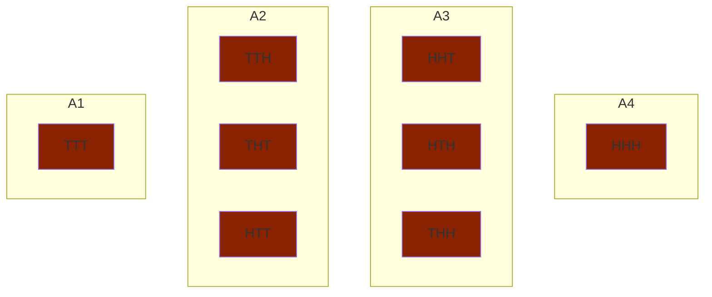

# Random Variables(RV), Probability Mass Function(PMF) of discrete RVs, Expectation-mean-variance

## Random Variables

A `random variable` is a function that assigns a real valued number to each outcome of a random experiment. 

Recall: $S$ denotes the sample space associated with a given random experiment. Let $X$ denote a value to each element in $S$. $Sx$ denotes the values of $X$ that it takes on.

### Example:

Suppose we toss a coin 3 times. Let $X$ a RV denote the number of heads.

$$
S = \{TTT, TTH, THT, HTT, THH, HTH, HHT, HHH\}
$$

$$
Sx = \{0, 1, 2, 3\}
$$

Any event associated with a random experiment taht is described in terms of $Sx$ has an equivalent interpretation in terms of $S$.

Example: $x=2, \{HHT, HTH, THH\}$

We can partition $S$ in terms of the values in $Sx$.

$A_1$ is a set of outcomes for which $X=0$.

$A_2$ is a set of outcomes for which $X=1$.

$A_3$ is a set of outcomes for which $X=2$.

$A_4$ is a set of outcomes for which $X=3$.

## Probability Mass Function(PMF) of a discrete RV

A `discrete` RV takes on countably many different values.

A discrete RV is fully described by its PMF.

$P(X=X_i) = P(A_I)$ where $A_i$ is the set of outcomes for which $X_S = X_i$.

### Example:

Suppose we did the previous example with a fair coin. 

$$
P(H) = P(T) = \frac{1}{2}\newline
P(HHH)=\frac{1}{8}, P(X=3)=\frac{1}{8}\newline
P(TTT)=\frac{1}{8}, P(X=0)=\frac{1}{8}\newline
P(X=1)=\frac{3}{8}\newline
P(X=2)=\frac{3}{8}
$$

### Properties of PMF:

1. $$P_x(X=X_i) \ge 0$$
2. $$\sum_{i=1 \in S_x}P(X=X_i) = 1$$
3. $$P(X in B) = \sum_{X_i = B}P_x(X=X_i)\newline= P(\cup_{X_i=B} \{S:X(S)=X_i\})\newline\sum_{X_i\in B}P(\{S:X(S)=X_i\})
$$

### Example: Coin Toss

What is the probability that $X$ is at least $2$?

Recall $Sx = \{0,1,2,3\}$.

$$
P(X \ge 2) = P(X \in \{2,3\})\newline
= P(X=2) + P(X=3)\newline
= \frac{3}{8} + \frac{1}{8}\newline
= \frac{1}{2}
$$

Think of PMF as a table:
| $X$ | $P(X=X_i)$ |
| --- | --- |
| $X_1$ | $P_1$ |
| $X_2$ | $P_2$ |
| $\vdots$ | $\vdots$ |
| $X_n$ | $P_n$ |

## Expectation

For any function $g(x)$ of a RV $x$, the expected value of $g(x)$, $\Bbb{E}[g(x)]$ is:

$$\Bbb{E}[g(x)] = \sum_{X_i=S_x}g(X_i)P(X=X_i)$$

* weighted average:
* the weight is specified by the partition of that $X_i$
* $X_i$'s could be equally likely

### Example:
| $X$ | $P(X)$ |
| --- | --- |
| $3$ | $\frac{1}{8}$ |
| $2$ | $\frac{3}{8}$ |
| $1$ | $\frac{3}{8}$ |
| $0$ | $\frac{1}{8}$ |

$$\Bbb{E}[X] = 0\times\frac{1}{8} + 1\times \frac{3}{8} + 2\times \frac{3}{8} + 3\times \frac{1}{8}$$

### Another Example:

| $X$ | $P(X)$ |
| --- | --- |
| $-1$ | $\frac{5}{12}$ |
| $0$ | $\frac{1}{3}$ |
| $2$ | $\frac{1}{4}$ |

$$\Bbb{E}[X] = -1\times\frac{5}{12} + 0\times \frac{1}{3} + 2\times \frac{1}{4}$$

$$\Bbb{E}[X^3] = -1^3\times\frac{5}{12} + 0^3\times \frac{1}{3} + 2^3\times \frac{1}{4}$$

### Important Properties of $\Bbb{E}[g(x)]$

Let $Z = ag(x)+bh(x) + c$ where $a,b,c$ are constants and $g(x)$ and $h(x)$ are functions of RV $x$.

Observe that $Z$ is also a RV.

Let's compute $\Bbb{E}[Z]$.

$$
\Bbb{E}[Z] = \Bbb{E}[ag(x) + bh(x) + c]\newline
= \sum_{X_i\in S_X}(ag(X_i)+bh(X_i)+c)P(X=X_i)\newline
= \sum_{X_i\in S_X} ag(X_i) P(X=X_i) + \sum_{X_i\in S_X}bh(X_i)P(X=X_i)+ \sum_{X_i\in S_X}c P(X=X_i)\newline
\text{Note: }c\sum_{X_i\in S_X}P(X=X_i)=c\times 1 = c\newline
= a\sum_{X_i\in S_X} g(X_i) P(X=X_i) + b\sum_{X_i\in S_X}h(X_i)P(X=X_i) + c\newline
= a\Bbb{E}[g(x)]+b\Bbb{E}[h(x)]+c
$$

### Consequences:

1. $$\Bbb{E}[aX] = a\Bbb{E}[X]$$
2. $$\Bbb{E}[X + c] = \Bbb{E}[X] + c$$
3. $$\Bbb{E}[c] = c$$

## Mean and Variance of RV $X$

`m` mean is: $\Bbb{E}[X] = \sum_{X_i\in S_X}X_iP(X=X_i) = m_X$

`V` variance is: $\Bbb{E}[(X-m_X)^2] = \sum_{X_i\in S_X}(X_i-m_X)^2P(X=X_i)$
